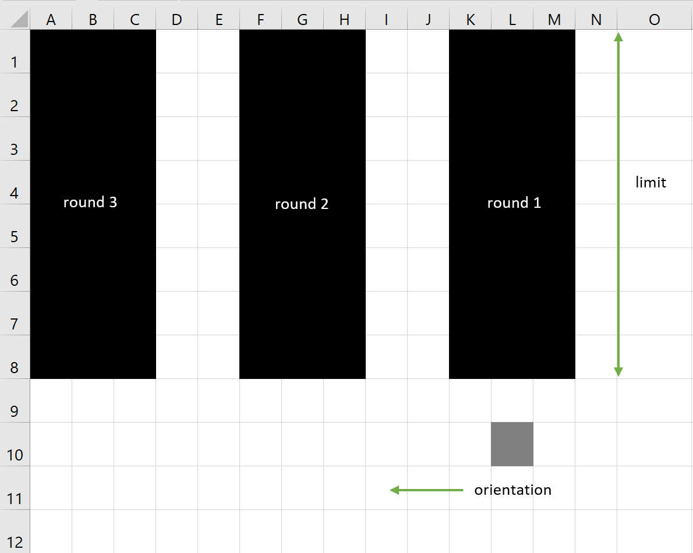

# GSS Miner
Simple Lua script for [ComputerCraft](http://www.computercraft.info/wiki/Main_Page) Minecraft mod.

Please support the creator of this amazing mod [here](https://www.computercraft.info/donate/).

It was created for [Turtles](http://www.computercraft.info/wiki/Turtle) to help me mine during exploration of [Tekxit3](https://www.technicpack.net/modpack/tekxit-3-official-1122.1253751) modpack.

## Features
- corridor length adjustment,
- rounds count setting,
- mining orientation,
- gravel/sand detection,
- automatic item sorting,
- unnecessary items dropping (can be adjusted in code, currently coblestone, stone, gravel),
- automatic refuelling.

## Usage
1. Craft the turtle.
2. Label the turtle (command `label set` - to preserve the script in turtle's memory when carrying the turtle in inventory).
3. Find the computer id (command `id`).
4. Copy the script to the desired computer's folder (`server_or_client_folder/world/computer/computer_id`, e.g. `Tekxit3/world/computer/0`).
5. Run the script by calling its name (`mn`) and providing arguments as following:

`mn limit rounds orientation`

### Arguments explanation

- limit (number): length of the corridor,
- rounds (number): number of corridors,
- orientation (`l` or `r`): which direction to go after finishing a corridor (left or right).

#### Example

`mn 8 3 l` results in:

## Warning
If the chunk that contains the turtle unloads, the execution of the script will stop. Keep the chunk loaded either by being close to the turtle or using some other technique (`/forceload`, `/setworldspawn` or some special mod).

## License
Please see `LICENSE` file.